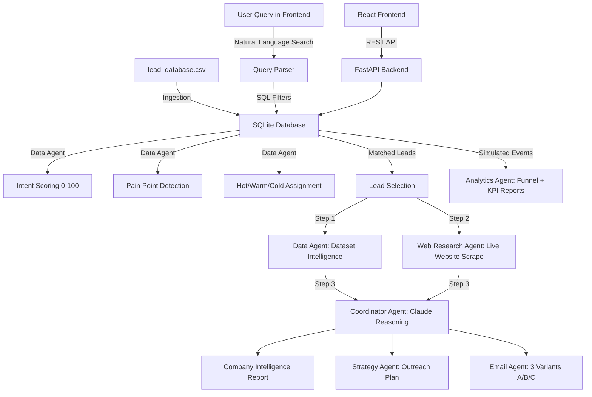

# Deep Research SDR Agent

An AI-powered SDR platform that ingests CRM-style lead data, enriches it with live company research, scores buying intent, generates outreach strategy and cold emails, and exposes the workflow through a FastAPI backend and React frontend.

## What This Project Does

This project automates a large part of the B2B sales development workflow:

- Ingests a flat lead dataset into a relational SQLite database
- Scores leads for intent and assigns outreach sequences
- Researches companies using live website scraping
- Uses Claude to generate company intelligence reports
- Produces outreach strategy and 3 personalized email variants
- Simulates funnel events for demo analytics
- Surfaces everything through a modern web dashboard

This is not just an email generator. It is an end-to-end agentic SDR pipeline.

## System Design

The platform is structured as a multi-agent workflow so each step can stay focused on a narrower job.

| Task | Agent |
| --- | --- |
| Structured lead and company analysis | Data Agent |
| Website understanding | Web Research Agent |
| Market/news signals | Market/News Agent |
| Cross-source reasoning | Coordinator Agent |
| Outreach planning | Strategy Agent |
| Cold email writing | Email Agent |
| Funnel and performance analysis | Analytics Agent |

### Why Multi-Agent Instead of One Model?

Different steps need different inputs and reasoning depth:

- Database extraction needs structured data access
- Website research needs scraping and summarization
- Strategy needs a synthesized view of the account
- Email generation works better when isolated from heavy research context
- Analytics needs aggregate pipeline reasoning, not single-lead reasoning

Breaking the workflow into smaller agents keeps prompts focused and improves consistency.

## End-to-End Workflow

```text
Lead CSV
  -> SQLite ingestion
  -> Intent scoring + pain-point detection + sequence assignment
  -> FastAPI lead/search endpoints
  -> Company intelligence generation
  -> Outreach strategy generation
  -> Email variant generation
  -> Event simulation
  -> Analytics dashboards and AI pipeline report
```

## Architecture Diagram



## Backend Walkthrough

### 1. Data Ingestion Pipeline

Primary entrypoint: [`pipeline_ai/run_pipeline.py`](/Users/roshan/Desktop/py/deep_reseaerch_SDR/pipeline_ai/run_pipeline.py)

| Step | What Happens |
| --- | --- |
| `init_db()` | Creates the SQLite schema |
| `ingest_crm_dataset()` | Reads `lead_database.csv` and populates relational tables |
| Intent scoring loop | Scores leads from 0-100 |
| Pain-point loop | Detects lead/company problems heuristically |
| Sequence loop | Assigns `Hot`, `Warm`, `Cold`, or `Ignore` |
| `run_full_simulation()` | Generates synthetic funnel activity for analytics |

Typical flow:

- CSV rows become `companies`, `employees`, and `leads`
- Enrichment logic computes intent score, problem, pitch, and sequence
- Simulation creates events like opens, replies, and meetings

### 2. API Layer

Main API file: [`pipeline_ai/app/main.py`](/Users/roshan/Desktop/py/deep_reseaerch_SDR/pipeline_ai/app/main.py)

The FastAPI app exposes endpoints for:

- `/api/leads` for list and sequence-filtered retrieval
- `/api/leads/search` for natural-language search
- `/api/leads/meta` for search helper keywords and demo dataset metadata
- `/api/leads/{id}` for lead details, events, and actions
- `/api/leads/{id}/intelligence` for AI company research
- `/api/leads/{id}/strategy` for AI outreach strategy
- `/api/leads/{id}/emails` for A/B/C cold email variants
- `/api/analytics/funnel` for funnel counts
- `/api/analytics/performance` for KPI and segment performance
- `/api/analytics/report` for the AI executive pipeline report

### 3. Natural Language Query Engine

Query parsing is handled by [`pipeline_ai/app/agents/query_agent.py`](/Users/roshan/Desktop/py/deep_reseaerch_SDR/pipeline_ai/app/agents/query_agent.py).

Flow:

1. User enters a plain-English search such as `AI companies needing automation`
2. The query agent extracts broad filters or keywords
3. FastAPI applies those filters against company and lead fields
4. Matching leads are returned to the dashboard

### 4. Company Intelligence Chain

Report generation lives in [`pipeline_ai/app/agents/report_agent.py`](/Users/roshan/Desktop/py/deep_reseaerch_SDR/pipeline_ai/app/agents/report_agent.py).

The intelligence flow is a 3-step chain:

1. Dataset Intelligence: load known CRM/company attributes from the database
2. Web Research: scrape the company website and extract usable text
3. Coordinator Reasoning: send both datasets into Claude for synthesis

Generated sections include:

- Executive summary
- Company overview
- Live website analysis
- Pain points
- What they likely need
- Outreach opportunity

### 5. Strategy Agent

Also in [`pipeline_ai/app/agents/report_agent.py`](/Users/roshan/Desktop/py/deep_reseaerch_SDR/pipeline_ai/app/agents/report_agent.py), the strategy generator uses lead score, role, company context, and outreach angle to produce:

- Lead priority
- Recommended messaging angle
- Sequence cadence
- Channel guidance
- Reply and booking probability estimates

### 6. Email Generation Agent

The same report agent also generates:

- Email A: problem-focused
- Email B: ROI-focused
- Email C: case-study-focused

The implementation uses XML-tag style extraction rather than strict JSON parsing to reduce truncation/parsing issues on long model outputs.

### 7. Analytics Agent

The backend aggregates simulated funnel data so the UI can visualize:

- Total leads contacted
- Reply rate
- Booking rate
- Show-up rate
- Performance by sequence
- Performance by industry
- Funnel stage counts

## Frontend Walkthrough

The frontend is a React + Vite single-page app in [`frontend`](/Users/roshan/Desktop/py/deep_reseaerch_SDR/frontend). It provides the user-facing experience for exploring leads, generating AI outputs on demand, and reviewing analytics.

### Frontend Stack

| Component | Technology |
| --- | --- |
| App shell | React 18 + Vite |
| Routing | `react-router-dom` |
| HTTP client | `axios` |
| Charts | `recharts` |
| Markdown rendering | `react-markdown` |
| Styling | Tailwind CSS + custom CSS |
| Icons | `lucide-react` |

### Frontend File Structure

Important files:

- [`frontend/src/main.jsx`](/Users/roshan/Desktop/py/deep_reseaerch_SDR/frontend/src/main.jsx): React entrypoint
- [`frontend/src/App.jsx`](/Users/roshan/Desktop/py/deep_reseaerch_SDR/frontend/src/App.jsx): router and global visual shell
- [`frontend/src/api/client.js`](/Users/roshan/Desktop/py/deep_reseaerch_SDR/frontend/src/api/client.js): Axios API wrapper
- [`frontend/src/pages/Landing.jsx`](/Users/roshan/Desktop/py/deep_reseaerch_SDR/frontend/src/pages/Landing.jsx): marketing/overview page
- [`frontend/src/pages/Dashboard.jsx`](/Users/roshan/Desktop/py/deep_reseaerch_SDR/frontend/src/pages/Dashboard.jsx): lead search and exploration workspace
- [`frontend/src/pages/Analytics.jsx`](/Users/roshan/Desktop/py/deep_reseaerch_SDR/frontend/src/pages/Analytics.jsx): analytics dashboard
- [`frontend/src/components/LeadModal.jsx`](/Users/roshan/Desktop/py/deep_reseaerch_SDR/frontend/src/components/LeadModal.jsx): lead detail drawer with AI actions
- [`frontend/src/components/Sidebar.jsx`](/Users/roshan/Desktop/py/deep_reseaerch_SDR/frontend/src/components/Sidebar.jsx): persistent navigation

### Routing and Page Flow

The app uses three routes:

- `/` -> Landing page
- `/dashboard` -> Lead dashboard
- `/analytics` -> Analytics dashboard

Routing is defined in [`frontend/src/App.jsx`](/Users/roshan/Desktop/py/deep_reseaerch_SDR/frontend/src/App.jsx). The app also mounts shared visuals such as the animated background and custom cursor globally.

### How the Frontend Talks to the Backend

The frontend uses an Axios client in [`frontend/src/api/client.js`](/Users/roshan/Desktop/py/deep_reseaerch_SDR/frontend/src/api/client.js) with:

- `baseURL: '/api'`
- `timeout: 90000`

During local development, Vite proxies `/api` requests to the FastAPI server on `http://localhost:8000` via [`frontend/vite.config.js`](/Users/roshan/Desktop/py/deep_reseaerch_SDR/frontend/vite.config.js).

That means:

- React runs on `http://localhost:3000`
- FastAPI runs on `http://localhost:8000`
- The browser only calls `/api/...`
- Vite forwards those requests to FastAPI

### Landing Page

[`frontend/src/pages/Landing.jsx`](/Users/roshan/Desktop/py/deep_reseaerch_SDR/frontend/src/pages/Landing.jsx) is the product overview page.

It includes:

- Product positioning and hero section
- Feature cards for intent scoring, intelligence, analytics, and email generation
- A four-step workflow explanation
- Calls to action that route users into the dashboard or analytics view

This page is informational only. It does not fetch API data.

### Dashboard Page

[`frontend/src/pages/Dashboard.jsx`](/Users/roshan/Desktop/py/deep_reseaerch_SDR/frontend/src/pages/Dashboard.jsx) is the main operating screen.

It does four main jobs:

1. Loads KPI metrics using `getPerformance()`
2. Loads searchable demo metadata using `getLeadsMeta()`
3. Loads lead lists using `getLeads()`
4. Runs natural-language searches using `searchLeads()`

Key UI behavior:

- Sticky AI search bar at the top
- Sequence filters: `All`, `Hot`, `Warm`, `Cold`, `Ignore`
- KPI cards for lead count, contact volume, reply rate, booking rate, and show-up rate
- Lead result list with intent score, role, company, country, sequence, and status
- Empty-state helper that suggests example keywords from the demo dataset
- Click any lead to open the detail modal

The dashboard also explains why every lead already has a funnel status: the backend simulation has already generated the event history for the demo environment.

### Lead Detail Modal

[`frontend/src/components/LeadModal.jsx`](/Users/roshan/Desktop/py/deep_reseaerch_SDR/frontend/src/components/LeadModal.jsx) is the most important interaction component in the frontend.

When a lead is opened, it first fetches base lead data with `getLead(id)`, then lets the user generate heavier AI outputs on demand through tabs:

- `Overview`: base CRM/company data, AI pitch, events, actions
- `Intelligence`: calls `getIntelligence(id)` and renders the markdown company research report
- `Strategy`: calls `getStrategy(id)` and renders the markdown outreach plan
- `Emails`: calls `getEmailVariants(id)` and displays the three email variants plus recommendation

This lazy-loading pattern is important because the expensive AI generations only happen when the user explicitly requests them.

### Analytics Page

[`frontend/src/pages/Analytics.jsx`](/Users/roshan/Desktop/py/deep_reseaerch_SDR/frontend/src/pages/Analytics.jsx) visualizes pipeline performance.

It loads:

- Funnel data from `getFunnel()`
- Performance data from `getPerformance()`
- Optional AI narrative report from `getAnalyticsReport()`

Rendered analytics include:

- KPI summary cards
- Funnel bar chart
- Stage-to-stage conversion chart
- Sequence distribution donut
- Reply rate by industry
- Sequence radar chart
- Country distribution
- Sequence performance table
- AI-generated executive pipeline report rendered from markdown

### Frontend User Journey

Typical user flow:

1. Open the landing page
2. Go to the dashboard
3. Search using plain English or filter by sequence
4. Open a lead
5. Review overview data
6. Generate intelligence report
7. Generate outreach strategy
8. Generate email variants
9. Move to analytics to review funnel performance
10. Generate the executive pipeline report

## Local Development Setup

### Prerequisites

- Python 3.10+
- Node.js 18+ and npm
- Anthropic API key

### 1. Backend Setup

```bash
python -m venv .venv
source .venv/bin/activate
.venv/bin/python -m pip install -r pipeline_ai/requirements.txt
.venv/bin/python -m pip install duckduckgo-search
```

Create `pipeline_ai/.env` and add your Anthropic key:

```env
ANTHROPIC_API_KEY=sk-ant-...
```

### 2. Seed the Database

```bash
.venv/bin/python pipeline_ai/run_pipeline.py
```

This creates/populates the SQLite database and runs the demo simulation.

### 3. Start the FastAPI Backend

```bash
cd pipeline_ai
../.venv/bin/uvicorn app.main:app --reload --port 8000
```

### 4. Start the React Frontend

In a second terminal:

```bash
cd frontend
npm install
npm run dev
```

The frontend will be available at `http://localhost:3000`.

### 5. Optional Legacy Streamlit Dashboard

The repository still includes the original Streamlit dashboard:

```bash
.venv/bin/streamlit run pipeline_ai/dashboard/streamlit_app.py
```

## API Contract Used by the Frontend

| Frontend method | Backend endpoint | Purpose |
| --- | --- | --- |
| `getLeads(params)` | `GET /api/leads` | Lead listing |
| `getLeadsMeta()` | `GET /api/leads/meta` | Search hints and demo metadata |
| `searchLeads(query)` | `POST /api/leads/search` | Natural-language lead search |
| `getLead(id)` | `GET /api/leads/{id}` | Full lead detail |
| `getIntelligence(id)` | `GET /api/leads/{id}/intelligence` | Company intelligence report |
| `getStrategy(id)` | `GET /api/leads/{id}/strategy` | Outreach strategy |
| `getEmailVariants(id)` | `GET /api/leads/{id}/emails` | 3 email variants |
| `getFunnel()` | `GET /api/analytics/funnel` | Funnel chart data |
| `getPerformance()` | `GET /api/analytics/performance` | KPI and segment metrics |
| `getAnalyticsReport()` | `GET /api/analytics/report` | AI executive report |

## Tech Stack Summary

| Layer | Technology |
| --- | --- |
| LLM | Claude Haiku |
| Backend API | FastAPI |
| ORM | SQLAlchemy |
| Database | SQLite |
| Scraping | `requests` + BeautifulSoup |
| Frontend | React + Vite |
| Charts | Recharts |
| Styling | Tailwind CSS |
| Markdown rendering | React Markdown |
| Legacy dashboard | Streamlit |

## Notes

- The React frontend is now the main product UI for day-to-day usage.
- The Streamlit app still exists as an earlier dashboard interface.
- AI-heavy actions are intentionally generated on demand to keep the UI fast.
- The demo dataset and simulated events make the app usable immediately after ingestion.
