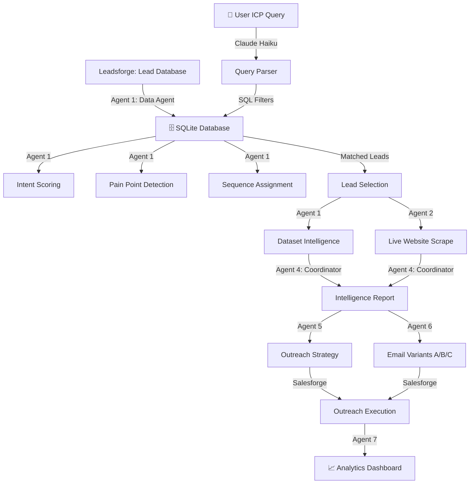

# Deep Research SDR Agent — System Walkthrough

## What This Project Does

This is an **AI Intelligence Layer** built on top of the **Leadsforge + Salesforge ecosystem** that automates the entire B2B sales research, lead qualification, and outreach strategy pipeline using a coordinated multi-agent AI workflow.

---

## System Architecture — Multi-Agent Pipeline Intelligence Layer (Built on Leadsforge + Salesforge)

This project was designed as an **AI intelligence layer on top of the Leadsforge and Salesforge ecosystem**, not as a replacement for those tools.

* **Leadsforge** is used for lead discovery and data retrieval (who to contact).
* **Salesforge** is used for outreach execution (sending emails and managing sequences).
* **Our system** acts as the intelligence layer that decides:
  * Which leads to prioritize
  * What problem the company likely has
  * What message to send
  * What outreach strategy to use
  * What to do next based on engagement
  * How to increase demo bookings and demo attendance

So the architecture is:

```
Leadsforge (Lead Database) → Our AI Intelligence Layer → Salesforge (Outreach Execution) → Calendly (Meeting Booking) → Analytics Dashboard
```

---

## Multi-Agent AI Workflow

Instead of using a single LLM to do everything, we designed the system as a **multi-agent workflow**, where each agent has a specific responsibility. This improves reasoning quality, reduces context overload, and makes the system scalable.

### Agent 1 — Lead Data Agent (Leadsforge Agent)

* Receives lead queries from the user (ICP search)
* Retrieves company and contact data from Leadsforge
* Provides structured data:
  * Company name, Industry, Company size, Website
  * Job title, Contact info
  * Basic intent signals (if available)

This agent answers: **Who should we contact?**

---

### Agent 2 — Web Research Agent

* Visits the company website
* Extracts homepage/about page text
* Summarizes what the company does
* Identifies their product, customers, and market

This agent answers: **What does this company do?**

---

### Agent 3 — Market / News / Financial Research Agent

* Uses external APIs such as:
  * News API (company news, announcements)
  * Financial APIs like Alpha Vantage (financial data)
  * Public company data sources
* Detects signals such as:
  * Funding, Hiring, Expansion
  * Product launches, Market activity

This agent answers: **Why might this company need a solution now?**

---

### Agent 4 — Intelligence Coordinator Agent (Main Reasoning Model)

This is the main reasoning agent with a larger context window. It combines:
* Leadsforge data
* Website research
* Market/news signals

Then generates a **Company Intelligence Report**:
* Executive summary, Company overview, Market position
* Pain points, Growth challenges, Sales challenges
* Outreach opportunity, Why this company is a good target

This agent answers: **What is the opportunity here?**

---

### Agent 5 — Strategy Agent

Based on the intelligence report, this agent generates:
* Lead priority, Outreach strategy, Sequence plan
* Follow-up plan, Recommended channel
* Conversion probability, Meeting booking probability, Demo attendance probability

This agent answers: **How should we approach this lead?**

---

### Agent 6 — Email Generation Agent

Generates personalized outreach emails:
* **Email A** — Problem-focused
* **Email B** — ROI-focused
* **Email C** — Case-study focused

This agent answers: **What should we say to them?**

---

### Agent 7 — Analytics Agent

Analyzes pipeline performance:
* Reply rates, Conversion rates, Meeting booking rates, Meeting attendance rates
* Best industries, Best job titles, Best sequences

Generates a **Pipeline Intelligence Report** explaining what is working, what is not, and how to improve.

This agent answers: **How do we improve the pipeline?**

---

## Why Multi-Agent Architecture?

A single model cannot efficiently handle lead search, company research, market research, strategic reasoning, email writing, and analytics simultaneously. So we split the system into specialized agents and used a **coordinator model** to combine their outputs.

| Task                     | Agent                |
| ------------------------ | -------------------- |
| Structured data analysis | Data Agent (Leadsforge) |
| Website understanding    | Web Research Agent   |
| Market signals           | News/Financial Agent |
| Strategic reasoning      | Coordinator Agent    |
| Outreach planning        | Strategy Agent       |
| Email writing            | Email Agent          |
| Analytics                | Analytics Agent      |

This approach prevents context overload, improves reasoning quality, makes the system scalable, and simulates how a real SDR team works.

---

## Final End-to-End Workflow

1. User defines Ideal Customer Profile
2. Leads are retrieved from Leadsforge
3. AI researches each company (website + news + signals)
4. System generates a Company Intelligence Report
5. System generates an Outreach Strategy Plan
6. System generates personalized email variants
7. Leads are pushed to Salesforge for outreach
8. Engagement events are tracked (opens, replies, bookings)
9. System recommends next best actions
10. System analyzes pipeline performance
11. System generates a Pipeline Intelligence Report

```
Lead Discovery → Research → Strategy → Outreach → Booking → Attendance → Analytics
```

**The goal is to increase qualified demo bookings and improve demo attendance by making outreach more intelligent, personalized, and data-driven.**

---

## Architecture Diagram



---

## Tech Stack

| Component | Technology |
|-----------|-----------|
| AI Engine | Claude Haiku 4.5 (Anthropic API) |
| Lead Source | Leadsforge |
| Outreach | Salesforge |
| Database | SQLite + SQLAlchemy ORM |
| Web Scraping | requests + BeautifulSoup4 |
| Frontend | Streamlit |
| Visualization | Plotly (dark theme) |
| Export | Markdown file download |
| Environment | Python 3.13, dotenv |
